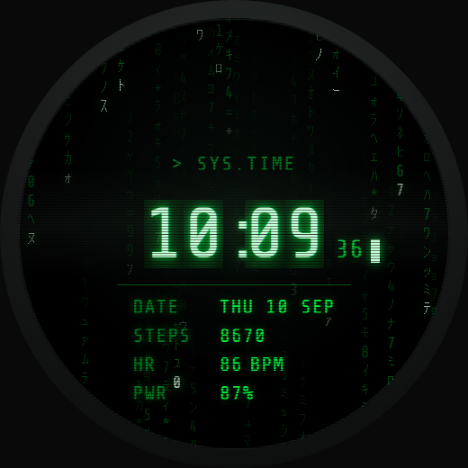
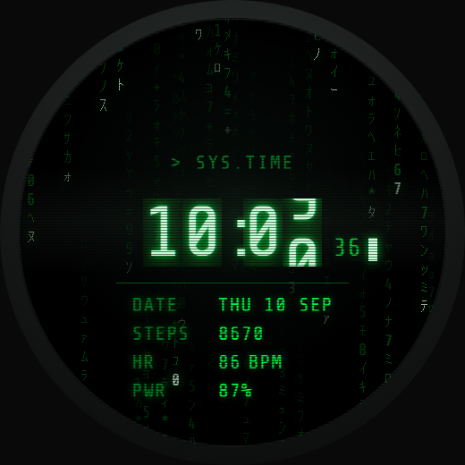
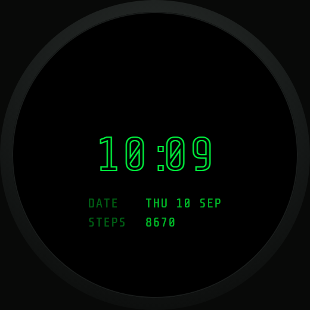

# Matrix Watchface

**Der Matrix-Code auf deinem Handgelenk.** Grüne Zeichen regnen über einen
schwarzen Grund, in der Mitte steht die Uhrzeit als Terminal-Ausdruck. Jede
Ziffer klappt beim Wechsel durch wie eine Fallblattanzeige — von 9 auf 2 rollt
sie vorwärts über 0 und 1.

Für die **Amazfit T-Rex 3 Pro 48mm**.



## Was drin steckt

- **Fallende Katakana** über die ganze Fläche, in Dichte und Tempo einstellbar
- **Klapp-Ziffern** — Uhrzeit, Schritte, Puls und Akku rollen bei jeder
  Änderung durch die Zwischenwerte
- **Phosphor-CRT-Look** mit Scanlines, Nachleuchten und langsam durchlaufendem
  Helligkeitsband
- **Blinkender Cursor** im Sekundentakt hinter der Uhrzeit
- **Datum, Schritte, Puls und Akkustand** als Terminal-Zeilen
- **Sparsame Always-On-Anzeige** — schwarzer Grund, konturierte Ziffern, kein
  Regen, keine Animation

| Klapp-Effekt | Always-On |
| --- | --- |
|  |  |
| Die Minutenziffer mitten im Rollen | Nur Uhrzeit, Datum und Schritte |

## Auf die Uhr bringen

Das Watchface liegt nicht im Zepp-Store, es wird über den Entwicklermodus
installiert. Das dauert einmalig etwa fünf Minuten.

**Was du brauchst**

- eine Amazfit T-Rex 3 Pro 48mm, mit der Zepp App gekoppelt
- [Node.js](https://nodejs.org/) ab Version 14 auf dem Rechner
- ein Zepp-Konto (dasselbe wie in der App)

**1. Zeus CLI installieren**

```bash
npm install -g @zeppos/zeus-cli
zeus login
```

**2. Entwicklermodus in der Zepp App einschalten**

Profil → bei den gekoppelten Geräten ganz nach unten scrollen → **Developer
Mode** aktivieren.

**3. Projekt holen und auf die Uhr schicken**

```bash
git clone https://github.com/<dein-account>/matrix-watchface.git
cd matrix-watchface
zeus preview
```

`zeus preview` baut das Paket und zeigt einen QR-Code im Terminal. Den mit der
Scan-Funktion im Developer Mode der Zepp App abfotografieren — das Watchface
wird direkt auf die Uhr installiert.

Danach liegt es auf der Uhr unter den Zifferblättern und kann wie jedes andere
ausgewählt werden.

**Alternative:** `zeus build` legt ein `.zab`-Paket in `dist/` ab.

## Kompatibilität

Gebaut und ausgelegt für die **T-Rex 3 Pro 48mm** (480 × 480, rund).

Andere runde Zepp-OS-Geräte mit 480 × 480 — etwa T-Rex 3 oder T-Rex Ultra 2 —
brauchen nur einen zusätzlichen Eintrag in `app.json`. Die 44-mm-Variante der
T-Rex 3 Pro hat 466 × 466 und würde ein eigenes Layout brauchen.

## Stand

Läuft. Der Matrix-Regen ist drin (24 Frames, 3 s Schleife, nahtlos). Was noch
fehlt, sind die Bildfolgen für die Klapp-Ziffern — bis dahin wechseln die
Ziffern hart statt zu klappen, alles andere funktioniert.

Wer mitbauen will: die technische Dokumentation steht in
[DEVELOPMENT.md](DEVELOPMENT.md).
